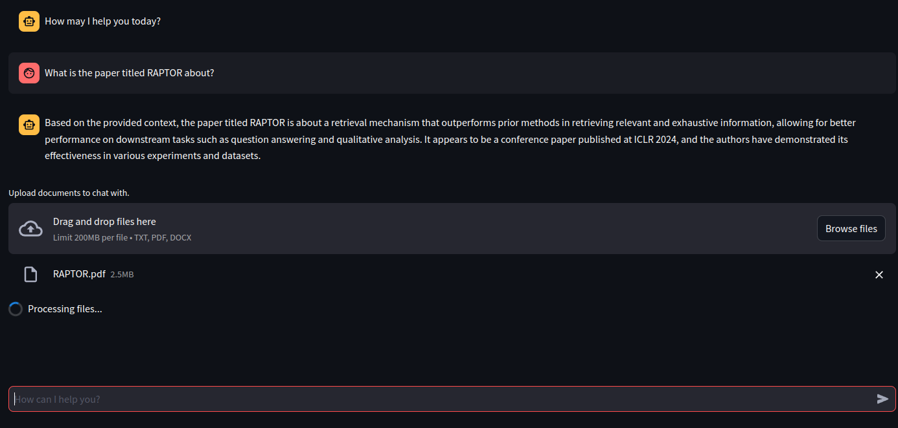
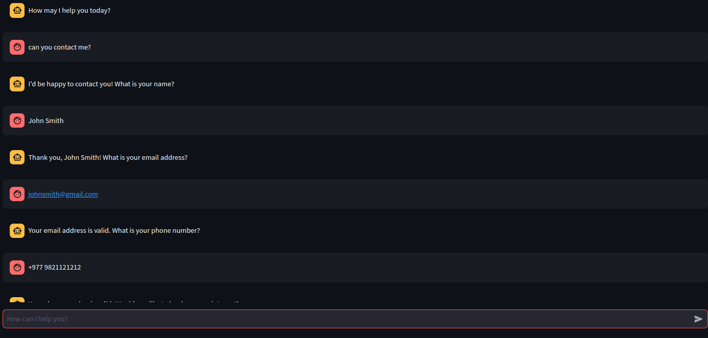

# Conversational Chatbot with Document Querying and Appointment Booking

This project is a conversational chatbot capable of:
1. **Chatting with uploaded documents**: Users can upload PDF or text files, which are parsed, embedded, and stored in a Qdrant vector database. Users can query these documents conversationally.
2. **Conversational form**: Collects user information (Name, Email, Phone) interactively while validating the inputs.
3. **Appointment booking**: Schedules an appointment using natural language date hints (e.g., "next Friday") and parses the date into `YYYY-MM-DD` format.

---

## Features
- **Document Querying**: Upload a document and engage in context-aware queries.
- **Conversational Form**: Collects and validates user inputs interactively.
- **Appointment Booking**: Automatically parses natural language dates and stores them for booking.

---

## Technologies Used
- **Qdrant Vectorstore**: A high-performance vector database used for storing embeddings, running inside a Docker container.
- **Groq LLM**: Powered by the **Llama 3** model with 70B parameters, ensuring high-quality conversational interactions.
- **LangChain**: For managing tools, chains, and agents.

---

## Setup Instructions

### 1. Prerequisites
- Docker installed on your machine
- Python 3.8 or above
- Environment setup (`pip install -r requirements.txt`)

### 2. Running the Qdrant Container
Use Docker to spin up a Qdrant vector database container. Run the following command:

```bash
docker run -d --name qdrant -p 6333:6333 qdrant/qdrant
```

---

## Screenshots

### 1. Document upload and conversations

### 2. Conversational form & Booking Appointment


